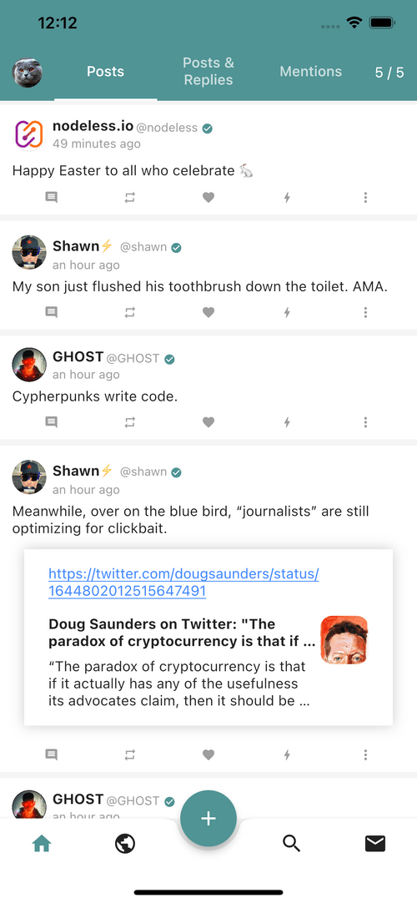
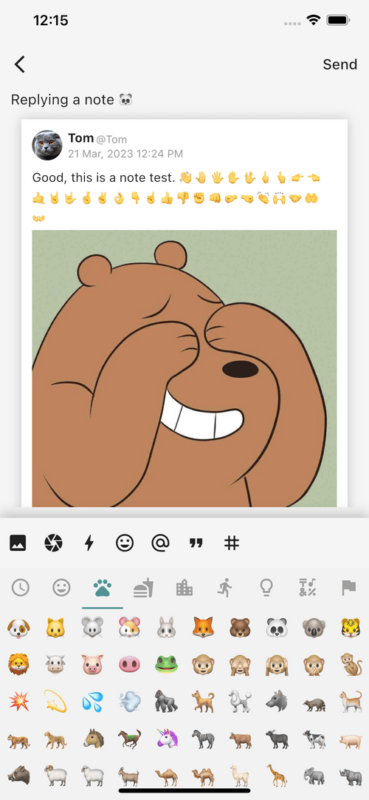
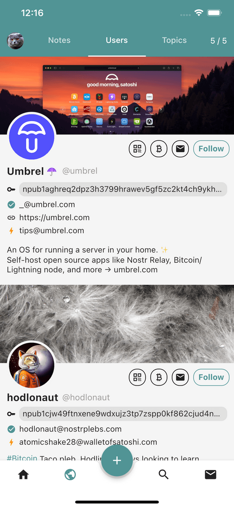
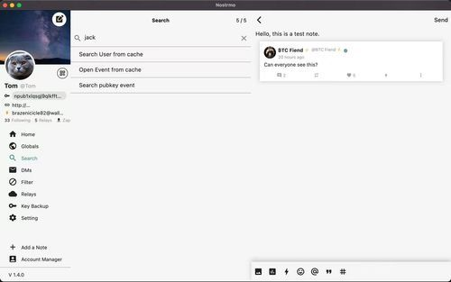
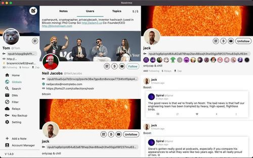
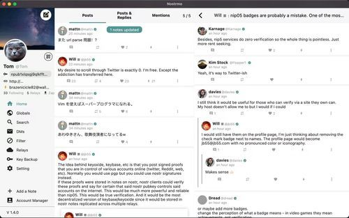

<div align="center">


# Plur

A flutter nostr client for all platforms.<br/> <a href="https://github.com/haorendashu/nostrmo_faq?tab=readme-ov-file#ios" target="_blank">IOS</a>, <a href="https://github.com/haorendashu/nostrmo_faq?tab=readme-ov-file#android" target="_blank">Android</a>, <a href="https://github.com/haorendashu/nostrmo_faq?tab=readme-ov-file#macos" target="_blank">MacOS</a>, <a href="https://github.com/haorendashu/nostrmo_faq?tab=readme-ov-file#windows" target="_blank">Windows</a>, <a href="https://web.nostrmo.com/" target="_blank">Web</a> and <a href="https://github.com/haorendashu/nostrmo_faq?tab=readme-ov-file#linux" target="_blank">Linux</a>.

</div>

## Screenshots

[](./docs/screenshots/mobile1.png)
[](./docs/screenshots/mobile2.png)
[](./docs/screenshots/mobile3.png)
[](./docs/screenshots/mobile4.png)<br/>
[](./docs/screenshots/pc1.jpeg)
[](./docs/screenshots/pc2.jpeg)
[](./docs/screenshots/pc3.jpeg)

## Features

- [x] NIP-01 (Basic protocol flow description)
- [x] NIP-02 (Follow List)
- [x] NIP-03 (OpenTimestamps Attestations for Events)
- [x] NIP-04 Encrypted Direct Message --- **unrecommended**: deprecated in favor of NIP-44)
- [x] NIP-05 (Mapping Nostr keys to DNS-based internet identifiers)
- [ ] NIP-06 (Basic key derivation from mnemonic seed phrase)
- [x] NIP-07 (`window.nostr` capability for web browsers)
- [x] NIP-08 Handling Mentions --- **unrecommended**: deprecated in favor of NIP-27)
- [x] NIP-09 (Event Deletion)
- [x] NIP-10 (Conventions for clients' use of `e` and `p` tags in text events)
- [x] NIP-11 (Relay Information Document)
- [ ] NIP-13 (Proof of Work)
- [x] NIP-14 (Subject tag in text events)
- [ ] NIP-15 (Nostr Marketplace (for resilient marketplaces))
- [x] NIP-18 (Reposts)
- [x] NIP-19 (bech32-encoded entities)
- [x] NIP-21 (`nostr:` URI scheme)
- [x] NIP-23 (Long-form Content)
- [ ] NIP-24 (Extra metadata fields and tags)
- [x] NIP-25 (Reactions)
- [ ] NIP-26 (Delegated Event Signing)
- [x] NIP-27 (Text Note References)
- [ ] NIP-28 (Public Chat)
- [x] NIP-29 (Relay-based Groups)
- [x] NIP-30 (Custom Emoji)
- [ ] NIP-31 (Dealing with Unknown Events)
- [ ] NIP-32 (Labeling)
- [ ] NIP-34 (`git` stuff)
- [x] NIP-35 (Torrents)
- [x] NIP-36 (Sensitive Content)
- [ ] NIP-38 (User Statuses)
- [ ] NIP-39 (External Identities in Profiles)
- [ ] NIP-40 (Expiration Timestamp)
- [x] NIP-42 (Authentication of clients to relays)
- [x] NIP-44 (Versioned Encryption)
- [ ] NIP-45 (Counting results)
- [x] NIP-46 (Nostr Connect)
- [x] NIP-47 (Wallet Connect)
- [ ] NIP-48 (Proxy Tags)
- [ ] NIP-49 (Private Key Encryption)
- [x] NIP-50 (Search Capability)
- [x] NIP-51 (Lists)
- [ ] NIP-52 (Calendar Events)
- [ ] NIP-53 (Live Activities)
- [x] NIP-55 (Android Signer Application)
- [ ] NIP-56 (Reporting)
- [x] NIP-57 (Lightning Zaps)
- [x] NIP-58 (Badges)
- [x] NIP-59 (Gift Wrap)
- [x] NIP-65 (Relay List Metadata)
- [x] NIP-69 (Zap Polls)
- [x] NIP-71 (Video Events)
- [x] NIP-72 (Moderated Communities)
- [x] NIP-75 (Zap Goals)
- [ ] NIP-78 (Application-specific data)
- [ ] NIP-84 (Highlights)
- [ ] NIP-89 (Recommended Application Handlers)
- [ ] NIP-90 (Data Vending Machines)
- [x] NIP-92 (Media Attachments)
- [x] NIP-94 (File Metadata)
- [x] NIP-95 (Shared File)
- [x] NIP-96 (HTTP File Storage Integration)
- [x] NIP-98 (HTTP Auth)
- [ ] NIP-99 (Classified Listings)

## Setting up Git Submodules

This project uses git submodules, so after you clone, be sure to initialize and update git submodules:

```bash
git submodule init
git submodule update
```

## Installing required tools
Plur uses Flutter to build, with tools and configuration files to ensure the right versions of Flutter, Dart, and Java are used. You can use either [mise-en-place](https://mise.jdx.dev) or [Homebrew](https://brew.sh) for this.

### Using mise-en-place
[mise-en-place](https://mise.jdx.dev) is a development environment setup tool. It allows you to define which tools you’re using for a given project and what versions of those tools to use. For Plur, mise specifies the versions of Java and Flutter that are required to build the app.

1. [Install and activate](https://mise.jdx.dev/getting-started.html) mise
2. Install Java, Ruby, CocoaPods, and Flutter from the `plur` directory: `mise install`
3. Point Flutter at the proper version of Java: `flutter config --jdk-dir $(mise where java)`
3. Ensure everything is set up properly (look for green checkmarks): `flutter doctor -v`
4. If the **Android toolchain** section shows a Java version of 21.0.x (or anything other than 17), Flutter will not be able to build. Try again to set the Java version using `flutter config --jdk-dir <JAVA_DIRECTORY_HERE>`

### Using Homebrew and FVM
Homebrew is a package manager for macOS. It allows you to install tools and use them from the command line. For Plur, FVM specifies the version of Flutter that’s required to build the app. With the Homebrew setup, the required version of Java is not specified outside of this README.

1. Install [Homebrew](https://brew.sh)
2. Install CocoaPods
3. Install Java 17: `brew install openjdk@17`
4. Install [FVM](https://fvm.app), then remember to always preface Flutter commands with `fvm`.
5. Install Flutter 3.24.5 with FVM from the `plur` directory: `fvm use 3.24.5`
6. Point Flutter at the proper version of Java: `fvm flutter config --jdk-dir /opt/homebrew/opt/openjdk@17`
7. Ensure everything is set up properly (look for green checkmarks): `fvm flutter doctor -v`
8. If the **Android toolchain** section shows a Java version of 21.0.x (or anything other than 17), Flutter will not be able to build. Try again to set the Java version using `flutter config --jdk-dir <JAVA_DIRECTORY_HERE>`

## Building the app
Before building the app for any platform, be sure you’ve run `git submodule init` and `git submodule update` in Terminal at the root of the repository.

### Android

#### Command line
Remember that if you’re using FVM, you always want to preface your Flutter commands with `fvm` so you can be sure you’re using the version of Flutter specified in the `.fvmrc` file. If you’re using `mise`, that’s handled internally by `mise` and the `.mise.toml` file, so you can just run `flutter` commands on their own.

1. Get dependencies with `[fvm] flutter pub get`
2. Build the app with `[fvm] flutter build apk --debug`

#### Android Studio
1. Open the root folder (`plur`) in Android Studio.
2. Android Studio may automatically prompt you to install the plugins for Dart and Flutter since you’ve opened a Flutter project. If so, you can install them from the prompt. Otherwise, search for them and install them from Settings > Plugins.
3. When prompted, restart Android Studio.
4. In Android Studio, open Settings > Languages & Frameworks > Dart. Check "Enable Dart support for the project 'plur’”.
5. Set the Dart SDK path. The location will depend on which setup you used. For mise, you run the following from your `plur` directory to copy your Dart SDK path to the clipboard: `echo $(mise where flutter)/bin/cache/dart-sdk | pbcopy`, then paste it into Android Studio (it’ll be something like `/Users/josh/.local/share/mise/installs/flutter/3.24.5-stable/bin/cache/dart-sdk`). For FVM, the path will contain your project folder and will look something like this: `/Users/josh/Code/plur/.fvm/flutter_sdk/bin/cache/dart-sdk`.
6. In Settings > Languages & Frameworks > Flutter, ensure that the path is set properly. It should either be like `/Users/josh/.local/share/mise/installs/flutter/3.24.5-stable` or  `/Users/josh/Code/plur/.fvm/flutter_sdk`.
7. Run an Android emulator using the Device Manager in the right side bar.
8. Select the running emulator in the top bar, then click the Run button.

### iOS and macOS

#### Xcode
To run the iOS or macOS app from Xcode, start in Terminal at the root of this repository:

1. `flutter pub get`
2. `flutter build ios --debug`
3. Open the workspace, which you can do from Terminal: `open ios/Runner.xcworkspace/`
4. In the top middle of Xcode, Select `Runner` and choose a simulator or device.
5. Build and run!

#### Android Studio
To run the iOS app from Android Studio:

1. Open the root folder (`plur`) in Android Studio.
2. Android Studio should automatically prompt you to install the plugins for Dart and Flutter since you’ve opened a Flutter project. If not, search for them and install them from Settings > Plugins.
3. In the top bar, near the middle of the screen is the configuration selector. Ensure that `main.dart` is selected.
4. In the Flutter Device Selection dropdown, you can choose a device or “Open iOS simulator”. After a simulator is open, you can choose it as the run destination.
5. Click the green Run button to build and run!

Building for Mac Designed for iPad is not supported from Android Studio, and macOS (desktop) does not seem to be, either. You can use Xcode to select My Mac (Designed for iPad) and run from there.

### Windows

```
flutter build windows --release
```

### Web

```
flutter build web --release --web-renderer canvaskit
```

### Linux

Linux depend on ```libsqlite``` and ```libmpv```, you can try to run this script to install before it run: 

```
sudo apt-get -y install libsqlite3-0 libsqlite3-dev libmpv-dev mpv
```

```
flutter build linux --release
```

## FAQ

You can find more info from this [FAQ](https://github.com/haorendashu/nostrmo_faq)
