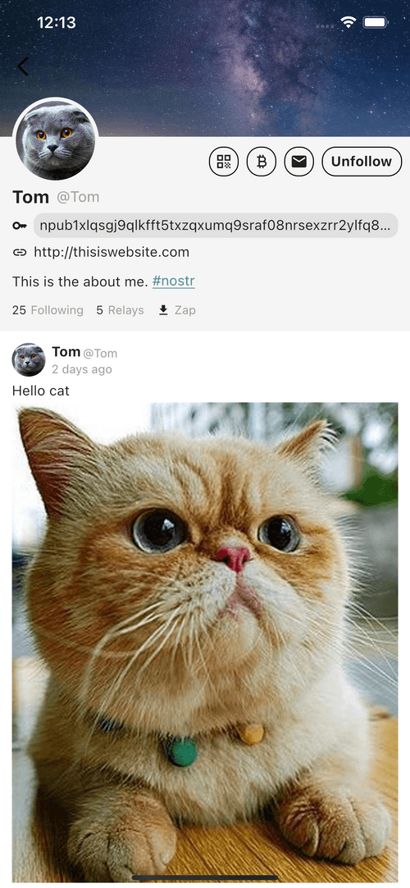

<div align="center">


# Plur

A flutter nostr client for all platforms.<br/> <a href="https://github.com/haorendashu/nostrmo_faq?tab=readme-ov-file#ios" target="_blank">IOS</a>, <a href="https://github.com/haorendashu/nostrmo_faq?tab=readme-ov-file#android" target="_blank">Android</a>, <a href="https://github.com/haorendashu/nostrmo_faq?tab=readme-ov-file#macos" target="_blank">MacOS</a>, <a href="https://github.com/haorendashu/nostrmo_faq?tab=readme-ov-file#windows" target="_blank">Windows</a>, <a href="https://web.nostrmo.com/" target="_blank">Web</a> and <a href="https://github.com/haorendashu/nostrmo_faq?tab=readme-ov-file#linux" target="_blank">Linux</a>.

</div>

## Screenshots

[](./docs/screenshots/mobile1.png)
[](./docs/screenshots/mobile2.png)
[](./docs/screenshots/mobile3.png)
[](./docs/screenshots/mobile4.png)<br/>
[](./docs/screenshots/pc1.jpeg)
[](./docs/screenshots/pc2.jpeg)
[](./docs/screenshots/pc3.jpeg)

## Features

- [x] NIP-01 (Basic protocol flow description)
- [x] NIP-02 (Follow List)
- [x] NIP-03 (OpenTimestamps Attestations for Events)
- [x] NIP-04 Encrypted Direct Message --- **unrecommended**: deprecated in favor of NIP-44)
- [x] NIP-05 (Mapping Nostr keys to DNS-based internet identifiers)
- [ ] NIP-06 (Basic key derivation from mnemonic seed phrase)
- [x] NIP-07 (`window.nostr` capability for web browsers)
- [x] NIP-08 Handling Mentions --- **unrecommended**: deprecated in favor of NIP-27)
- [x] NIP-09 (Event Deletion)
- [x] NIP-10 (Conventions for clients' use of `e` and `p` tags in text events)
- [x] NIP-11 (Relay Information Document)
- [ ] NIP-13 (Proof of Work)
- [x] NIP-14 (Subject tag in text events)
- [ ] NIP-15 (Nostr Marketplace (for resilient marketplaces))
- [x] NIP-18 (Reposts)
- [x] NIP-19 (bech32-encoded entities)
- [x] NIP-21 (`nostr:` URI scheme)
- [x] NIP-23 (Long-form Content)
- [ ] NIP-24 (Extra metadata fields and tags)
- [x] NIP-25 (Reactions)
- [ ] NIP-26 (Delegated Event Signing)
- [x] NIP-27 (Text Note References)
- [ ] NIP-28 (Public Chat)
- [x] NIP-29 (Relay-based Groups)
- [x] NIP-30 (Custom Emoji)
- [ ] NIP-31 (Dealing with Unknown Events)
- [ ] NIP-32 (Labeling)
- [ ] NIP-34 (`git` stuff)
- [x] NIP-35 (Torrents)
- [x] NIP-36 (Sensitive Content)
- [ ] NIP-38 (User Statuses)
- [ ] NIP-39 (External Identities in Profiles)
- [ ] NIP-40 (Expiration Timestamp)
- [x] NIP-42 (Authentication of clients to relays)
- [x] NIP-44 (Versioned Encryption)
- [ ] NIP-45 (Counting results)
- [x] NIP-46 (Nostr Connect)
- [x] NIP-47 (Wallet Connect)
- [ ] NIP-48 (Proxy Tags)
- [ ] NIP-49 (Private Key Encryption)
- [x] NIP-50 (Search Capability)
- [x] NIP-51 (Lists)
- [ ] NIP-52 (Calendar Events)
- [ ] NIP-53 (Live Activities)
- [x] NIP-55 (Android Signer Application)
- [ ] NIP-56 (Reporting)
- [x] NIP-57 (Lightning Zaps)
- [x] NIP-58 (Badges)
- [x] NIP-59 (Gift Wrap)
- [x] NIP-65 (Relay List Metadata)
- [x] NIP-69 (Zap Polls)
- [x] NIP-71 (Video Events)
- [x] NIP-72 (Moderated Communities)
- [x] NIP-75 (Zap Goals)
- [ ] NIP-78 (Application-specific data)
- [ ] NIP-84 (Highlights)
- [ ] NIP-89 (Recommended Application Handlers)
- [ ] NIP-90 (Data Vending Machines)
- [x] NIP-92 (Media Attachments)
- [x] NIP-94 (File Metadata)
- [x] NIP-95 (Shared File)
- [x] NIP-96 (HTTP File Storage Integration)
- [x] NIP-98 (HTTP Auth)
- [ ] NIP-99 (Classified Listings)

## Git Module

After you clone this project, be sure to initialize and update git submodules:

```bash
git submodule init
git submodule update
```

## Building the app

### Android

```
-- build for appbundle
flutter build appbundle --release

-- build for apk
flutter build apk --release --split-per-abi
```

### iOS and macOS

#### Xcode
To run the iOS or macOS app from Xcode, start in Terminal at the root of this repository:

1. `git submodule init` (if you haven’t already)
2. `flutter pub get`
3. `flutter build ios --debug`
4. Open the workspace, which you can do from Terminal: `open ios/Runner.xcworkspace/`
5. In the top middle of Xcode, Select `Runner` and choose a simulator or device
6. Build and run!

#### Android Studio
To run the iOS app from Android Studio, start in Terminal at the root of this repository:

1. `git submodule init` (if you haven’t already)
2. Open the root folder in Android Studio
3. Install the plugins for Dart and Flutter (Android Studio may prompt you to do this)
4. In the top bar, near the middle of the screen is the configuration selector. Ensure that `main.dart` is selected.
5. To the left of the configuration selector is the Flutter Device Selection dropdown where you can choose a device or Open iOS simulator. After a simulator is open, you can choose it as the run destination.
6. Click the green Run button (to the right of the the configuration selector where `main.dart` is selected)

Building for Mac Designed for iPad is not supported from Android Studio, and macOS (desktop) does not seem to be, either. You can use Xcode to select My Mac

### Windows

```
flutter build windows --release
```

### Web

```
flutter build web --release --web-renderer canvaskit
```

### Linux

Linux depend on ```libsqlite``` and ```libmpv```, you can try to run this script to install before it run: 

```
sudo apt-get -y install libsqlite3-0 libsqlite3-dev libmpv-dev mpv
```

```
flutter build linux --release
```

## FAQ

You can find more info from this [FAQ](https://github.com/haorendashu/nostrmo_faq)
